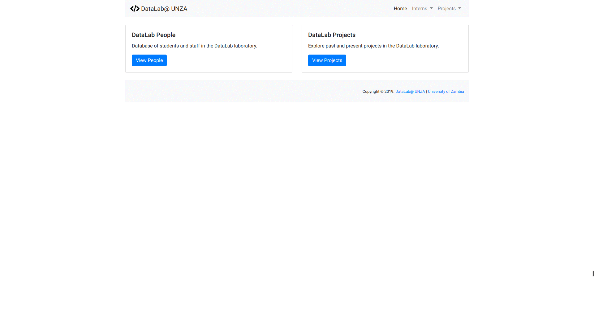

# About datalabApp

A basic Node.js Express-based CRUD Web application used as a teaching aid.

## Technology Stack
* [Node.js] (https://nodejs.org/) 
* [MongoDB] (https://www.mongodb.com) 

## Frameworks
* [Express] (https://expressjs.com) 
* [Mongoose] (https://mongoosejs.com/) 
* [Bootstrap] (https://getbootstrap.com) 

## Demo
A [demo instance of the datalabApp](https://datalabapp.herokuapp.com) has been deployed to [Heroku](https://www.heroku.com), with the backend MongoDb instance running via [MongoDB Atlas](https://www.mongodb.com/cloud/atlas).

